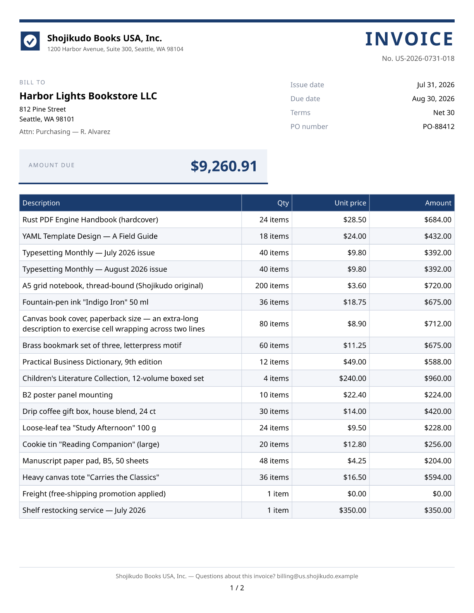
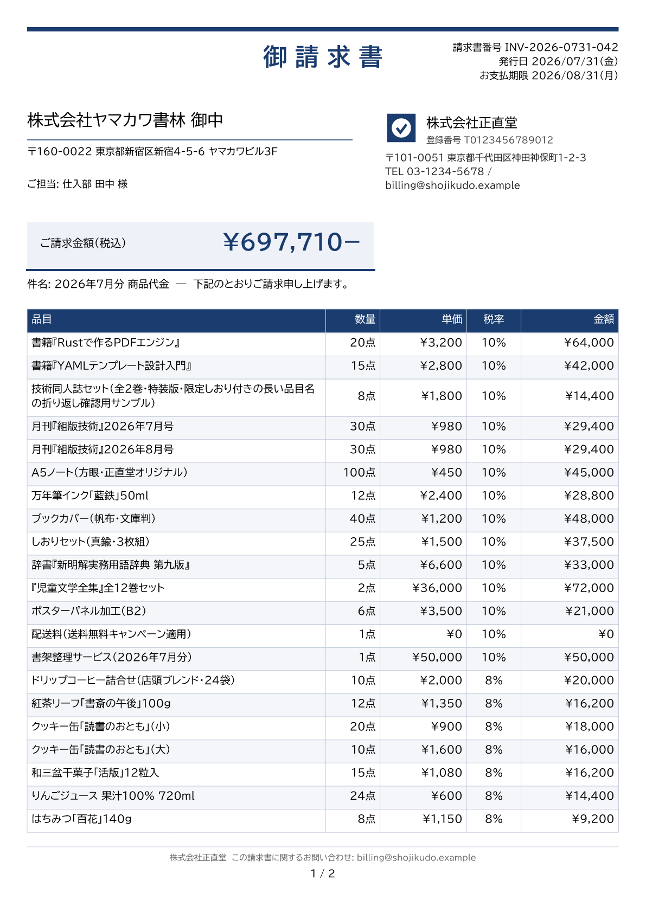
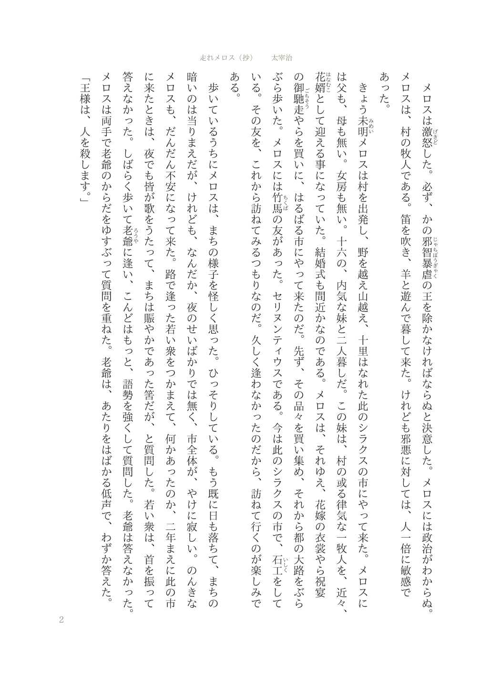
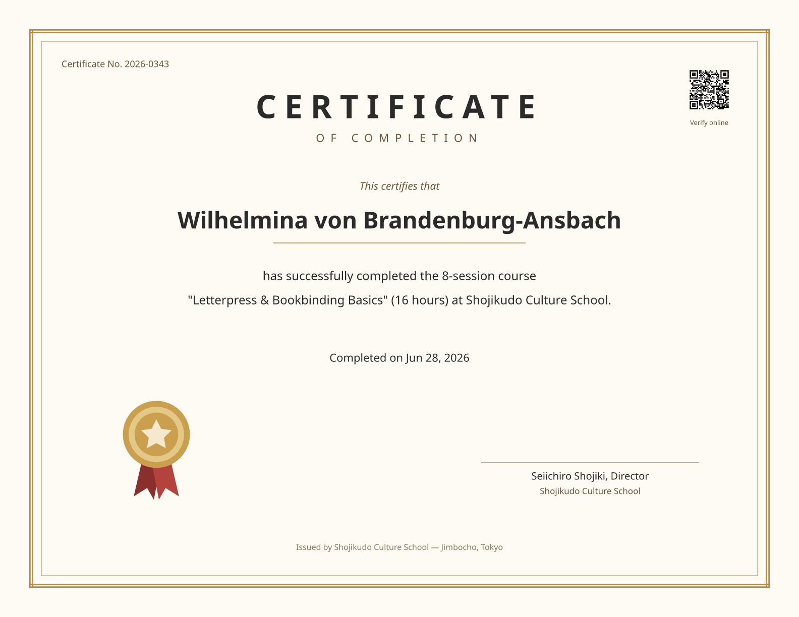
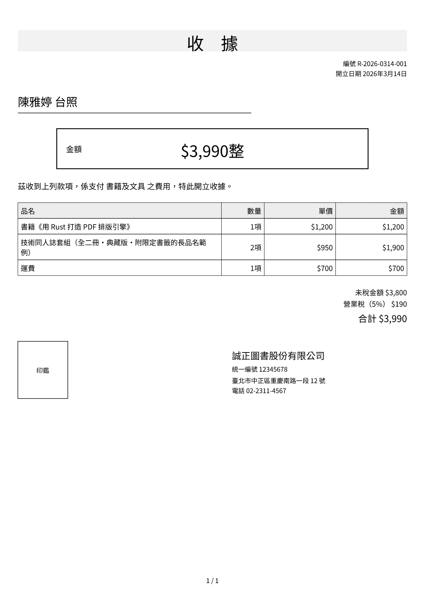
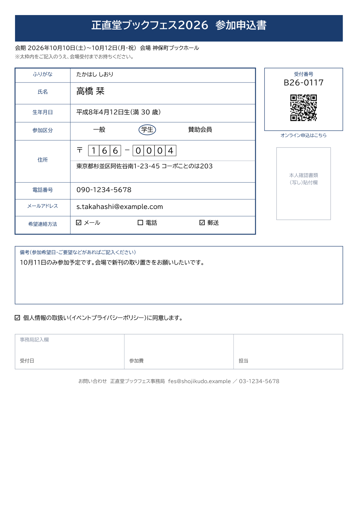
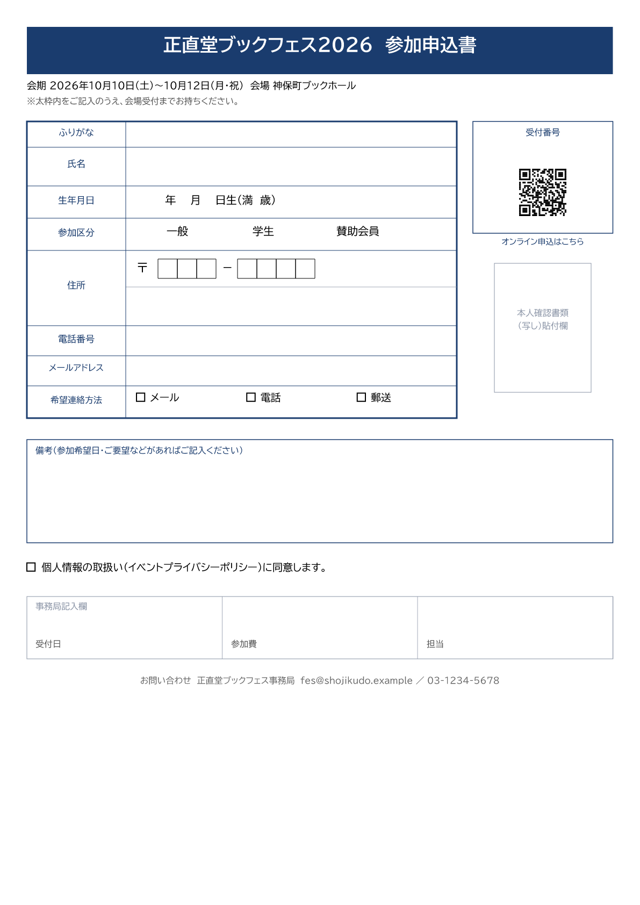
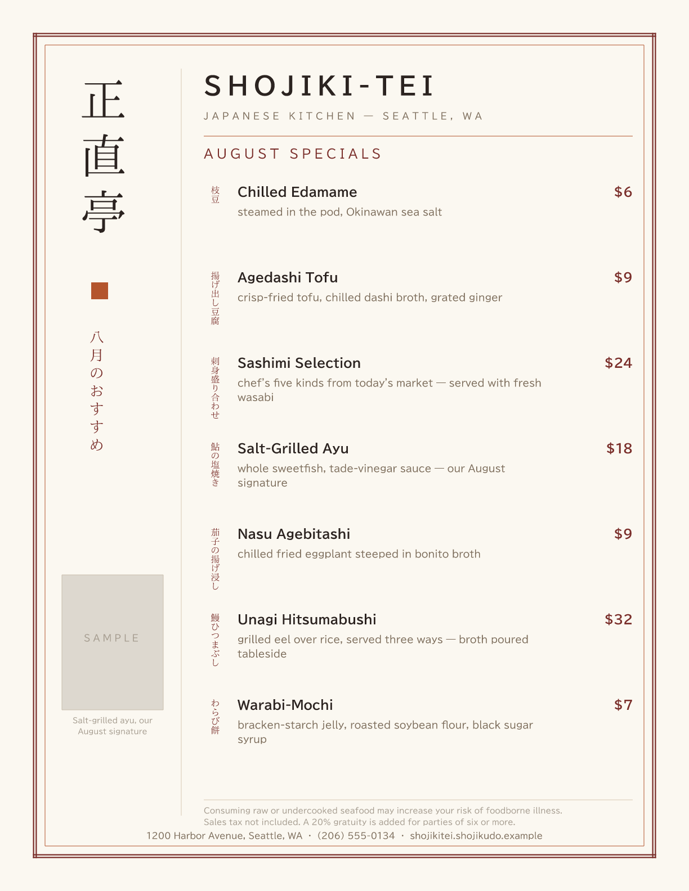
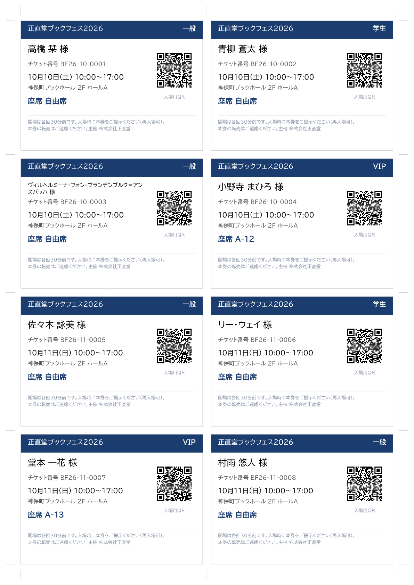

# Shojiku

[](https://github.com/kengos/shojiku/actions/workflows/ci.yml)

**Write YAML. Get PDFs. Built for AI agents.**

[shojiku.pages.dev](https://shojiku.pages.dev) — the gallery, the
tutorials, and a playground that renders in your browser.

> [!IMPORTANT]
> **Pre-1.0 — not recommended for production yet.** The template wire
> format (`templates.yml` / `definitions.yml`), the CLI surface and every
> Rust crate API change **without notice or a migration path** while the
> design settles, so templates you write today may need rework. What is
> already solid: the engine renders every document in the Gallery below,
> under a CI gate at 100% line coverage, and its output is byte-identical
> across machines.

Shojiku makes business-document PDF generation **pain-free**: receipts,
invoices, estimates, delivery notes, application forms, worksheets. A
document is two plain YAML files — a template and a field catalog —
that humans and AI agents can read, diff, review, and repair; the Rust
engine renders them with your data into deterministic PDFs.

It runs **anywhere** and needs no service: a CLI and Docker image for
servers and CI, browser WASM for the Designer (rendering stays on the
machine — nothing is uploaded), a stdio MCP server for AI agents, and
native SDKs for seven languages — Python, Node, Ruby, .NET, Java, Go and
PHP, each installing from its own registry (see [Install](#install)).
Local-first by design — a
PM producing a customer estimate or a teacher printing worksheets
renders on their own machine.

Shojiku grew out of years of [Thinreports](https://github.com/thinreports)
pain — implicit binding keys, per-field format sprawl, a layout format
no human or AI could safely hand-edit — and is built so those pains
cannot come back. It declares no Thinreports compatibility: there is no
`.tlf` import; migration is AI-assisted visual regeneration.

## Quickstart

A PDF, from nothing but Docker:

```bash
docker run --rm ghcr.io/kengos/shojiku:edge > receipt.pdf
```

That renders a bundled example with the image's default command. Here is
another one — a two-page US invoice, and the YAML that produced it:

<p align="center">
  <a href="examples/business/invoice-en/">
    
  </a>
</p>

<details>
<summary><b>The YAML behind it</b> — how those marks on the page are written</summary>

<br>

The amount-due panel is a container that draws its own background and
rule, with two texts inside it (excerpt from
[`examples/business/invoice-en/templates.yml`](examples/business/invoice-en/templates.yml)):

```yaml
- id: amount_due
  type: container
  box: { w: 320, h: 44 }
  style:
    backgroundColor: "#eef2f8"
    borderColor: "#1a3c6e"
    borderWidth: { bottom: 2 }
  items:
    - type: text
      box: { x: 12, y: 15, w: 110, h: 14 }
      text: AMOUNT DUE
      styleNames: [ label ]
    - type: text
      box: { x: 116, y: 8, w: 192, h: 28 }
      data: { key: totals.total }
      style: { fontSize: 19, textAlign: right, lineHeight: 1.4, fontWeight: bold, color: "#1a3c6e" }
```

The data is separate, and plain
([`params.json`](examples/business/invoice-en/params.json)):

```json
{
  "totals": { "subtotal": 8506.0, "tax": 754.91, "total": 9260.91 },
  "items": [
    { "description": "Rust PDF Engine Handbook (hardcover)",
      "quantity": 24, "unit_price": 28.5, "amount": 684.0 }
  ]
}
```

`9260.91` reaches the page as `$9,260.91` because the document says so
once, at the top of the template — not at each field that happens to be
money:

```yaml
defaults:
  locale: en-US
  currency: USD
  formats:
    currency: symbol
```

The table below it is one `type: table` item bound to `items`; the 18
rows paginate onto a second page with the header repeated, because the
item says `autoPageBreak: true` and `repeatHeader: true` — you do not
compute where the break falls.

That is the whole idea: `{key}` bindings with no format code attached, a
document-level default deciding how a kind of value looks, and named
styles instead of repeated attributes. The
[template reference](docs/engine/README.md) covers the rest, and the
third file — [`definitions.yml`](examples/business/invoice-en/definitions.yml)
— is the field catalog that says which keys exist and what they mean, so
a human or an AI can check a template against it before rendering.

</details>

**Languages and locales.** The same template machinery drives documents
in English, Japanese, Simplified and Traditional Chinese, Hindi,
Filipino and Thai: `en-US` and `ja-JP` are built into the engine, and
[`packs/locale/`](packs/locale/) adds `zh-CN`, `zh-TW`, `hi-IN`,
`fil-PH` and `th-TH` — each supplying its own currency, date,
number-grouping and unit wording, with font fallback to match
(Devanagari, Thai, Simplified and Traditional faces all ship in
[`packs/fonts/`](packs/fonts/)). The
receipt in the Gallery below is the clearest demonstration: **one
geometry, six locales**, differing only by the pack. Japanese adds
vertical writing, ruby, kinsoku line-breaking and wareki dates; Indian
locales get lakh/crore digit grouping.

To render your own files, mount the directory they are in:

```bash
docker run --rm -v "$PWD:/work" ghcr.io/kengos/shojiku:edge render \
  --templates /work/templates.yml --params /work/params.json \
  --definitions /work/definitions.yml \
  --output /work/out.pdf
```

The image is multi-arch (x86-64 and arm64) and carries the CLI, the MCP
server, fonts, locale packs and every bundled example — nothing else to
install.

**[docs/quickstart.md](docs/quickstart.md)** takes it from
there: where to get a first template to edit, how to see your changes,
and how to register the stdio MCP server (`shojiku-mcp` — validate /
render_preview / inspect_layout / capabilities, plus list_examples /
get_example for the bundled examples) in Claude Code, Claude
Desktop, VS Code or Cursor.

The agent-first loop in one line — register the server and ask:

> Make an A4 receipt with our logo, a tax-breakdown table, and a QR code
> linking to the receipt page.

The agent writes the YAML, renders a preview, inspects the layout
tree, and iterates on the diagnostics until the output matches. The
agent playbook is
[skills/shojiku-template-author/](skills/shojiku-template-author/SKILL.md).

## Install

The engine is one binary. The FFI SDKs carry it inside the package, so
there is no separate engine to install and no build step; the two
subprocess SDKs (Go, PHP) drive the CLI binary instead and need it
installed alongside.

| | Install | Package |
| --- | --- | --- |
| Docker | `docker pull ghcr.io/kengos/shojiku:edge` | also on Docker Hub as `kengos/shojiku` |
| Python | `pip install shojiku` | [`shojiku`](https://pypi.org/project/shojiku/) |
| Node | `npm install shojiku` | [`shojiku`](https://www.npmjs.com/package/shojiku) |
| Ruby | `gem install shojiku` | [`shojiku`](https://rubygems.org/gems/shojiku) |
| .NET | `dotnet add package Shojiku` | [`Shojiku`](https://www.nuget.org/packages/Shojiku) |
| Java | Maven / Gradle — **also declare the platform classifier** | [`jp.kengos:shojiku`](https://central.sonatype.com/artifact/jp.kengos/shojiku), see [sdk/java](sdk/java/README.md) |
| Rust | `cargo install shojiku-cli` | [`shojiku-cli`](https://crates.io/crates/shojiku-cli); [`shojiku-authoring`](https://crates.io/crates/shojiku-authoring) is the embedding surface |
| Go | `go get github.com/kengos/shojiku/sdk/go` | [`github.com/kengos/shojiku/sdk/go`](https://pkg.go.dev/github.com/kengos/shojiku/sdk/go); drives the CLI binary, install it separately |
| PHP | `composer require shojiku/shojiku` | [`shojiku/shojiku`](https://packagist.org/packages/shojiku/shojiku); drives the CLI binary, install it separately |
| CLI binary | [GitHub releases](https://github.com/kengos/shojiku/releases/latest) | per-platform archives plus the shared packs archive, checksummed in `SHA256SUMS` |

The CLI archives are a plain binary per platform plus one shared archive
of the fonts and locale packs, used like this:

```bash
tar xzf shojiku-0.1.0-darwin-arm64.tar.gz
tar xzf shojiku-0.1.0-packs.tar.gz
./shojiku render --templates templates.yml --params params.json --output out.pdf
```

Extract both into the same directory and the CLI finds `./packs` by
itself; keep them apart and point `--font-dir` / `--locale-dir` (or
`$SHOJIKU_FONT_DIR` / `$SHOJIKU_LOCALE_DIR`) at the packs. Every asset is
listed in the release's `SHA256SUMS`.

Prebuilt binaries cover Linux and macOS on x86-64 and arm64, and Windows
on x86-64. Outside that matrix, build from source — see
[docs/from-source.md](docs/from-source.md).

## Lifecycle

Rendering is the core; the full document lifecycle is the scope:

```text
Template / Definitions
  -> Bundle          (not built)
  -> Layout
  -> Render
  -> PDF / PNG Preview
  -> Sign
  -> Verify
  -> Archive         (not built)
```

Form layout expressed as reviewable YAML, a GUI designer *(live at
[shojiku.pages.dev/designer](https://shojiku.pages.dev/designer/) —
it renders in your browser, nothing is uploaded)*, a stable CLI
*(shipped)*, SDKs *(built for all seven languages, Ruby as the reference
implementation)*, and an electronic signature/trust pipeline *(built: CLI
`sign` / `verify`)*.
[What exists today](#what-exists-today) has the rest.

## Gallery

Eight of the runnable [examples/](examples/) — every one is just a
`templates.yml` + `definitions.yml` + `params.json` the CLI renders to
the PDF/PNG shown (click through for the source; images and links here
resolve in the repository source, not in a docs-only copy). Where an example
ships multiple `params-*.json`, every output comes from the **same
template** with different data:

<!-- gallery:generated:start (edit examples/gallery.yml, then `make site-data`) -->
|  |  |
| :---: | :---: |
| [](examples/business/invoice-ja/)<br>**Invoice (ja)** — 22 line items paginate with a repeating table header, per-tax-rate totals, QR + link; `params-short.json` renders a 3-item single page from the same template. | [](examples/typography/novel-ja/)<br>**Vertical short story, paperback style (ja)** — Run, Melos! (excerpt): vertical columns paginate with their ruby, strict kinsoku + hanging punctuation, tate-chu-yoko in the colophon, vertical page numbers. |
| [](examples/business/invoice-en/)<br>**Invoice (en-US)** — Letter-size US invoice: USD with cents, plural-aware quantities (`1 item` / `24 items`), Net-30 terms, payment box + pay-online QR. | [](examples/forms/certificate-en/)<br>**Certificate (en-US)** — Letter-landscape certificate: double-rule frame, wide letter spacing, real italics, verification QR. |
| [](examples/business/receipt-zh-tw/)<br>**Receipt (zh-TW)** — The locale-pack story: the same receipt geometry as ja / zh-CN / 80mm en-US, with currency, dates, tax wording, and font fallback swapped by the pack. | [](examples/forms/application-form-ja/) [](examples/forms/application-form-ja/)<br>**Application form, filled ↔ blank (ja)** — ONE template, two params files: form marks, 〒 entry cells, wareki with a blank-form `placeholder`; not a single pt shifts. |
| [](examples/business/restaurant-menu-us/)<br>**Restaurant menu (en + vertical writing)** — An American Japanese restaurant's specials: English menu, USD prices, and the vertical 正直亭 brand column + per-dish vertical names carrying the Japanese feel. | [](examples/business/event-tickets-ja/)<br>**Event tickets (ja)** — 2×4 n-up imposition with per-ticket QR, trim marks for the cutter, `placeholder` seat fallback; 14 attendees flow onto sheet 2 automatically. |

17 more live in [examples/](examples/):
[Estimate](examples/business/estimate-ja/) (The invoice's sibling: single-rate one-pager, estimate-terms box, discount row),
[Delivery note](examples/business/delivery-note-ja/) (Between estimate and invoice: quantity-bundling `headerGroups`, data-driven row styling that tints only rows with items remaining, a receipt-stamp field; partial ↔ complete delivery as two data files),
[Pickup slip](examples/business/pickup-slip-ja/) (The Thinreports migration artifact — the migration walkthrough's result),
[Product catalog](examples/business/catalog-ja/) (Variable-height `repeat_flow` cards with dynamic images),
[Shipping labels](examples/business/shipping-labels-ja/) (2×3 n-up labels with 〒 cells and an overflowing contents list),
[Rirekisho (JIS-style résumé)](examples/forms/rirekisho-ja/) (A3 spread, blank ↔ filled from one template),
[Certificate (ja)](examples/forms/certificate-ja/) (Landscape certificate with a double-rule frame and full bleed),
[Kokugo reading worksheet](examples/typography/kokugo-print-ja/) (A framed vertical passage from Run, Melos! with ruby, then vertical questions read right to left with answer boxes and kanji cells — a grade-school reading-comprehension sheet),
[Genkoyoshi (vertical)](examples/typography/genkoyoshi-ja/) (200-character manuscript paper with Aozora ruby),
[Genkoyoshi (horizontal)](examples/typography/genkoyoshi-yoko-ja/) (The 400-character horizontal sheet),
[Recipe booklet (en-US ↔ ja)](examples/lifestyle/recipe-booklet-en/) (A Japanese recipe video, reprinted for the kitchen counter: a photo-led shopping page whose third column carries substitutes, then `repeat_flow` step cards that paginate whole, with the source URL and its QR in the footer of every page. Not one reader-facing word lives in the template — even the table's column labels are bindings — so the English and Japanese sheets are one file and two params),
[Receipt (ja)](examples/business/receipt-ja/) (The quickstart document: containers with `%` widths, a boxed total, tax breakdown, issuer block and QR),
[Receipt (80mm thermal, en-US)](examples/business/receipt-us/) (A custom-size 80mm thermal-printer receipt),
[Receipt (zh-CN)](examples/business/receipt-zh-cn/) (The simplified-Chinese member of the locale set),
[Receipt (hi-IN)](examples/business/receipt-hi-in/) (Devanagari conjuncts + lakh/crore digit grouping),
[Receipt (fil-PH)](examples/business/receipt-fil-ph/) (Latin face + Philippine peso from the fil-PH pack),
[Receipt (th-TH)](examples/business/receipt-th-th/) (Thai wrapped at word boundaries, dated in the Buddhist era).
<!-- gallery:generated:end -->

**Developer examples** — [`examples/dev/layout-showcase`](examples/dev/layout-showcase/)
is the engine feature index, not a business document: one labeled
section per feature family (rich text, flex/grid, tables, overflow,
QR, form marks, vertical writing, …), each demo followed by the YAML that
produces it. [`examples/presets/blank-a4`](examples/presets/blank-a4/) is one of the
Designer's per-locale blank presets (an empty page at each catalog
locale's standard size — A4 or Letter), not a document sample.

## What exists today

- **The engine** renders, signs and verifies. Everything in the Gallery
  above is its output, and the CLI covers `render` / `validate` /
  `inspect` / `preview` / `sign` / `verify` / `capabilities`.
  [docs/engine/features.md](docs/engine/features.md) is the capability
  inventory.
- **The Designer** — a browser GUI that round-trips the same YAML the
  engine reads, never its own format — is live at
  [shojiku.pages.dev/designer](https://shojiku.pages.dev/designer/) and
  also runs locally ([below](#running-the-gui-locally)). It renders in
  the browser, so nothing you open there is uploaded.
- **The SDKs** for seven languages are built, and each installs from its
  own registry ([Install](#install)).

Not built: the bundle and archive stages of the lifecycle.
[docs/architecture.md](docs/architecture.md) is the target architecture.

## Documentation

Start with [docs/README.md](docs/README.md) — it routes by what you came
to do:

- **Write or fix a template** → [docs/engine/](docs/engine/README.md),
  the template reference: one MDN-style page per feature (items, box
  model, styles, tables, repeats, …) with syntax, defaults, and
  diagnostics. The Designer app is live at
  [shojiku.pages.dev/designer](https://shojiku.pages.dev/designer/), and
  [Running the GUI locally](#running-the-gui-locally) covers the local
  route; non-engineers typically have an AI agent author the YAML
  ([skills/shojiku-template-author/](skills/shojiku-template-author/SKILL.md),
  AI-only playbook).
- **Embed or evaluate the engine** → today's integration surfaces are
  the CLI / Docker image (`shojiku render` as a subprocess), the stdio
  MCP server (`shojiku-mcp` — validate / preview / inspect for AI
  agents), the browser WASM bindings (`engine/wasm`), and the language
  SDKs — [Install](#install) lists which install today. All seven are
  built; Ruby (`sdk/ruby`) is the reference the other six mirror
  ([docs/agents/sdk.md](docs/agents/sdk.md)).
  [docs/engine/features.md](docs/engine/features.md) lists
  what works today.
- **Contribute** → [docs/architecture.md](docs/architecture.md) (system
  overview, boundaries), then [docs/agents/](docs/agents/) (per-area
  policy) and [docs/guidelines.md](docs/guidelines.md) (formatting +
  100%-coverage policy).
- **See what changed** → [CHANGELOG.md](CHANGELOG.md), which also
  carries what has landed since the last release.

### Supported language versions

The rule, which outlives any number below: **every upstream release line
that is not end-of-life, except those whose upstream support ends within
six months.** A floor that dies a month after release helps nobody.

Every push runs each SDK's full gate on **both ends of its range** — the
minimum and the newest published line — so neither is a claim. The middle
releases are not run: breakage lives at the ends, and a middle release
rarely breaks alone.

| SDK | Minimum | Also gated on |
| --- | --- | --- |
| Ruby | 3.3 | 4.0 |
| Python | 3.11 | 3.14 |
| Node | 22 | 26 |
| Java | 21 | 25 |
| PHP | 8.3 | 8.5 |
| Go | 1.25 | 1.26 |
| .NET | 10 | — |

.NET has one line because 10 is currently the only one admitted: 8 LTS
and 9 STS both end in 2026-11.

Java's floor is 21 rather than a newer LTS because the binding is JNA,
chosen for exactly that reason — the foreign-function API is final only
in 22, which would exclude the LTS most enterprise and systems-integrator
deployments actually run.

Outside these ranges, the CLI and the Docker image are the universal
fallback: they take the same templates and params and produce the same
bytes.

### If you are an AI agent

Two different jobs, two different entry points — take the one that
matches yours.

**Using Shojiku to author a document**: register the MCP server
(`shojiku-mcp`, stdio — see [Quickstart](#quickstart)) and follow
[skills/shojiku-template-author/](skills/shojiku-template-author/SKILL.md).
Write YAML, render a preview, inspect the layout, repair, repeat.
[skills/](skills/) also carries a render debugger, a definitions author,
a Thinreports migrator, and — as a worked vertical — a recipe booklet
built from a Japanese cooking video, printable in the cook's own
language.

**Working on this codebase**: read [CLAUDE.md](CLAUDE.md) first. It is a
deliberately token-dense routing table, not prose — it maps each
directory to the one file that describes it, so you can reach the
relevant design record without searching the tree. From there,
[docs/code-map/](docs/code-map/README.md) tells you what every file
does, and [docs/agents/](docs/agents/) tells you what has already been
decided and why. Reading the map for the area you are about to touch is
cheaper than grepping it cold, and it is how you avoid re-deriving a
decision that was settled deliberately.

## Development

**Everything runs in pinned Docker images through `make` — no host Rust
or Node toolchain is required** (the Makefile mounts the repo and pins
the toolchain/cache volumes; the Rust, WASM, and GUI gates all work this
way). You only need Docker and `make`. Run `make help` for the full
target list, and see [CONTRIBUTING.md](CONTRIBUTING.md) for the
check-your-work workflow; the common ones:

| Command | What it does |
| --- | --- |
| `make verify` | Full local CI mirror — line budget, fmt, clippy, tests, 100% coverage, cargo-deny, example byte-compare, WASM build, GUI gates, Docker build + Trivy. Green == safe to push. |
| `make verify:engine` / `verify:gui` / `verify:docker` | One scope's whole bar. Prints a single PASS/FAIL line and exits with the gate's real code |
| `make lint:gui` / `test:gui` / `budget:gui` | Fast slices of a scope (same for `:engine`) — iterate on these, conclude with `verify:` |
| `cat .make-logs/last-error.log` | Where any failed gate lands, headed with the target, exit code and the step it died at |
| `make test` / `make coverage` | Rust workspace tests / 100%-line coverage gate |
| `make gui` | GUI workspace gates: `tsc` typecheck + Biome lint + Vitest coverage, in a `node:24` container |
| `make wasm` | Build the browser WASM engine bindings (`engine/wasm/pkg`) + size budget |
| `make examples` | Re-render every bundled example's committed PDF/PNG |
| `make docker-build` / `make docker-render` | Build the runtime image (`shojiku-ci:local`) / render the bundled example through it — the published image is [ghcr.io/kengos/shojiku:edge](https://github.com/kengos/shojiku/pkgs/container/shojiku) ([from source](docs/from-source.md)) |

### Running the GUI locally

The Designer ships as a static app (`gui/designer-app`): a locale-keyed
preset catalog opening into the full editor (canvas preview, property
panel, diagnostics, undo/redo, file open/export). It is live at
[shojiku.pages.dev/designer](https://shojiku.pages.dev/designer/); the
ways to run your own copy:

- **`make gui-serve`** builds the complete app image (WASM engine + Vite
  build + assembled presets/fonts/locale packs — `gui/designer-app/Dockerfile`)
  and serves it with `docker run` at `http://localhost:8788/` (override
  with `GUI_SERVE_PORT=…`) — the production-shaped way to check the app.
- **`make gui-dev`** runs the Vite dev server (hot reload) in Docker at
  `http://localhost:5173/` for iterating on `gui/` code; it builds the
  WASM engine first if `engine/wasm/pkg` is missing and assembles the
  runtime `data/` tree the dev server serves. A matching
  `.devcontainer/` exists for editor-integrated work (same pnpm store;
  engine artifacts still build on the host via `make wasm`).
- **`make gui-e2e`** builds the same app image and runs the Playwright
  golden path against it (on-demand, not part of `make verify`).
- **`make gui`** runs the GUI gates (typecheck + lint + Vitest, including
  real-engine integration tests that render through the WASM bindings —
  never a mock) in Docker.
- **`make wasm-e2e`** is the engine-only browser golden path: it
  instantiates the WASM engine, injects fonts, and paints rendered pages
  to a `<canvas>` (Playwright in Docker, on-demand — not part of
  `make verify`).
- If you *do* have host Node 24 + pnpm 11, you can run the same suites
  directly in `gui/` (`pnpm install --frozen-lockfile && pnpm -r test`),
  but the Docker path above is the supported, toolchain-free one.

## Support

If Shojiku is useful to you, you can support its development on
[GitHub Sponsors](https://github.com/sponsors/kengos). Donations fund
nothing specific and promise nothing in return — the project stays
focused on the OSS core.

## License

Licensed under any of

- Apache License, Version 2.0 ([LICENSE-APACHE](LICENSE-APACHE))
- MIT license ([LICENSE-MIT](LICENSE-MIT))
- BSD 3-Clause license ([LICENSE-BSD](LICENSE-BSD))

at your option.
